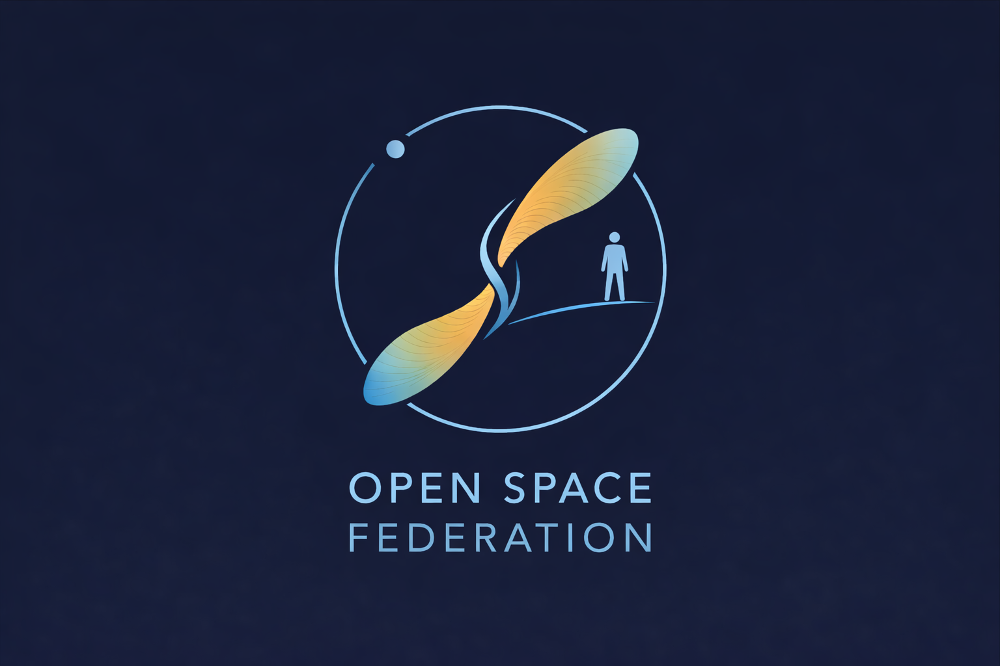

# Open Space Federation

## Logo

The Open Space Federation logo is inspired by the wings of the propeller seed.

These seeds spread not through force, but through structure — falling away from the parent tree and traveling far when carried by the wind, propagating wherever they land.

Watching propeller seeds drift and spin through the air, it’s striking how far complex journeys can emerge from simple structure, patience, and time. Given the right conditions and enough time, small structures can travel far beyond their point of origin.

The logo’s dual form also reflects the dual meaning of “open space”:
- openness in knowledge, technology, materials, and methods
- and an open, loosely connected space of ideas and interested individuals, rather than a centralized organization

Open Space Federation exists to explore whether openness — which already shapes software, hardware, and knowledge — could someday help humanity spread out into space.

